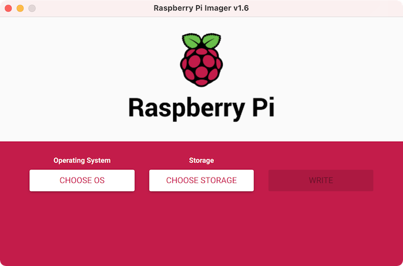
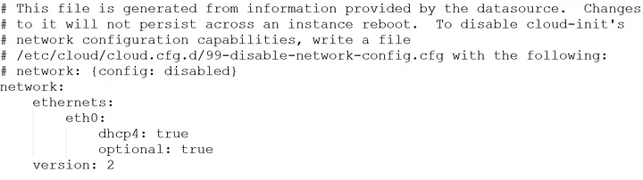
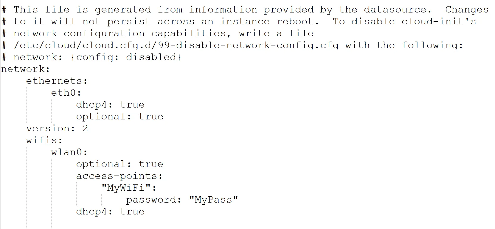

<h1 align="center">
<!--    -->
  <br />
  Desktopify
</h1>

<p align="center"><b>Convert Ubuntu Server for Raspberry Pi to a Desktop.</b></p>
<!-- <div align="center"></div> -->
<p align="center">Made with 💝 for </p>

## Introduction

Desktopify is a simple script to convert
[Ubuntu Server for the Raspberry Pi](https://ubuntu.com/download/raspberry-pi)
to one of the official Ubuntu desktop flavours.

We have a Discord for this project: [](https://discord.gg/hy7uZfX)

[](https://www.youtube.com/watch?v=umtZuUJOU38)
## Requirements    
  * SD Card (preferred 32 GB or more) & MicroSD to SD Adaptor (to connect sd card to your laptop/PC).
  * Raspberry PI 4 model B (preferred with 8GB ram).
  * Monitor, Keyboard and necessary cables to connect them to RaspberryPi.
  * Mobile data (approx 2GB) for downloading dependencies.
  

## Setup

  * Download [Raspberry Pi Imager](https://www.raspberrypi.com/software/) software to choose your respective OS compatible with raspberryPi.
  * Connect the SD card to your laptop/PC and then open RPI Imager software, you will see screen like below    
    
    
  * Select `CHOOSE OS` --> `Other Support OS` --> `UBUNTU`.    
  * Choose any server image file. For this i'm using `ubuntu 20.04.05 64 bit server image file`.    
  * Click `CHOOSE STORAGE` and then select your SD card.
  * finally click on `WRITE` and wait for some time.
  * After completion, insert sd card to your RaspberryPi and connect keyboard & Monitor to it. You can power RaspberryPI from your laptop in case your don't have powerbank.    
  * power on t your PI and wait for 1-2 minutes.
  * Lgin to ubuntu OS. By default the username and password are both `ubuntu`.    
  * Change your password and then login again.
  * Yo need to connect to a wifi to download necessary packages. Best way is to connect to your MObile hotspot.
  * Now you need to know your wifi card name. For that type following command on the ubuntu server    

  ``` 
  ls /sys/class/net
  ```  
  On my system, the output is like this and my wifi card name is `wlan0`.    

  For further steps, i'll be assuming the same for you.    
  * Assuming that your Mobile network wifi name/SSID is `MyWifi` and password is `MyPass`.   
  * type the following command to edit your network configuration    
  ``` 
  sudo nano /etc/netplan/50-cloud-init.yaml
  ```
  by default you will see the following data in this file    

      
  * Edit this file as follows  
    
      

  * After writing the above data, type `ctrl + O` to write, then `Enter` to save and then `ctrl + X` to exit from the file.    
  * type `sudo reboot` and then login again. Check if your are connect to your mobile wifi using the command    
  ```
  hostname -I
  ```  
  If you see some IP address as output, means you'r done.    
  
  <!-- * Boot the Ubuntu Server SDHC on a Raspberry Pi 2, 3 or 4.
  * Login to the Raspberry Pi; username `ubuntu` and password `ubuntu`
      * You will be prompted to change the password
  * Clone the project
    * `git clone https://github.com/wimpysworld/desktopify.git`
  * Change your current directory to desktopify directory
    * `cd desktopify`
  * Convert the server to a desktop
    * `sudo ./desktopify --de ubuntu-mate` -->

## Installation    
  1. clone this repo by typing following command on ubuntu server    
  ``` 
  https://github.com/wimpysworld/desktopify.git
  ```     
  2. go to the repo folder and download the desktop image using following commands    

  ``` 
  cd desktopify
  ``` 

  ```
  ./desktopify --de ubuntu
  ``` 

  Here i'm choosing ubuntu as my desktop environent. You can choose other ubuntu desktops also.    
  Available desktop environments are:    
    lubuntu    
    kubuntu    
    ubuntu    
    ubuntu-budgie    
    ubuntu-kylin    
    ubuntu-mate    
    ubuntu-studio    
    xubuntu    

  3. Now wait for some time (may be an hour or so depending on your internet speed). After completion reboot your system using    
  ``` 
  sudo reboot
  ``` 
  4. You'r done.


## TODO

- [ ] Emoji status

## DONE

- [x] Install GPIO utilities and libraries
- [x] Enable Bluetooth
- [x] Make sure it's Ubuntu on a Pi
- [x] Make Network Manager the default backend
- [x] Prevent low power WiFi mode
- [x] Disable overscan
- [x] Enable fkms driver
- [x] Enable boot splash
- [x] Enable Firefox hardware acceleration
- [x] Create a snap
- [x] Kubuntu
- [x] Lubuntu
- [x] Ubuntu
- [x] Ubuntu Budgie
- [x] Ubuntu Kylin
- [x] Ubuntu MATE
- [x] Ubuntu Studio
- [x] Xubuntu
- [x] Drop `dpkg-architecture` requirement
- [x] Optimise Ubuntu MATE (Marco) window manager
- [x] Enable initial setup
- [x] Prevent pointless re-installs
- [x] Install snaps
- [x] Install gpio tools     


## References :    
  * [video demonstration](https://www.youtube.com/watch?v=umtZuUJOU38)    
  * [medium blog for network setup](https://huobur.medium.com/how-to-setup-wifi-on-raspberry-pi-4-with-ubuntu-20-04-lts-64-bit-arm-server-ceb02303e49b)    

